# Guia Completo do MuleSoft RPA Builder

## Índice
1. [Introdução ao MuleSoft RPA Builder](#introdução-ao-mulesoft-rpa-builder)
2. [Conceitos Fundamentais de RPA](#conceitos-fundamentais-de-rpa)
3. [Toolbox do MuleSoft RPA Builder](#toolbox-do-mulesoft-rpa-builder)
4. [Exemplos Práticos Completos](#exemplos-práticos-completos)
5. [Boas Práticas e Dicas](#boas-práticas-e-dicas)
6. [Troubleshooting Comum](#troubleshooting-comum)

---

## Introdução ao MuleSoft RPA Builder

### 🤖 O que é RPA (Robotic Process Automation)

**RPA (Robotic Process Automation)** é uma tecnologia que permite automatizar tarefas repetitivas e baseadas em regras, simulando as ações que um usuário humano faria em sistemas digitais. Os "robôs" ou "bots" interagem com aplicações através da interface do usuário, executando processos de negócio de forma autônoma.

#### Características principais do RPA:
- ✅ **Não invasivo**: Não requer modificações nos sistemas existentes
- ✅ **Baseado em regras**: Segue lógicas predefinidas e determinísticas
- ✅ **Interface gráfica**: Interage com aplicações como um usuário humano
- ✅ **Escalável**: Pode executar múltiplas instâncias simultaneamente
- ✅ **Auditável**: Mantém logs detalhados de todas as ações

### 🏗️ Visão Geral do MuleSoft RPA Builder

O **MuleSoft RPA Builder** é uma plataforma robusta para desenvolvimento e execução de automações RPA, oferecendo:

#### Componentes principais:
- **🎨 Designer Visual**: Interface drag-and-drop para criar fluxos
- **🧰 Toolbox**: Biblioteca de ações pré-construídas organizadas por categoria
- **🏃 Runtime**: Motor de execução dos bots
- **📊 Control Center**: Console de gerenciamento e monitoramento
- **🔧 Orchestrator**: Orquestração de múltiplos bots e processos

#### Arquitetura:
```
┌─────────────────┐    ┌─────────────────┐    ┌─────────────────┐
│   Designer      │    │   Runtime       │    │ Control Center  │
│   (Desenvolv.)  │───▶│   (Execução)    │◀───│   (Monitor.)    │
└─────────────────┘    └─────────────────┘    └─────────────────┘
         │                       │                       │
         ▼                       ▼                       ▼
┌─────────────────┐    ┌─────────────────┐    ┌─────────────────┐
│   Toolbox       │    │   Aplicações    │    │   Orchestrator  │
│   (Actions)     │    │   (Sistemas)    │    │   (Orquest.)    │
└─────────────────┘    └─────────────────┘    └─────────────────┘
```

### 🎯 Casos de Uso Típicos

#### 1. **Processamento de Documentos**
- Extração de dados de PDFs, imagens e documentos
- Classificação automática de documentos
- Validação e verificação de informações

#### 2. **Automação de Planilhas**
- Atualização de dados em Excel
- Consolidação de informações de múltiplas fontes
- Geração de relatórios automatizados

#### 3. **Automação Web**
- Preenchimento de formulários online
- Web scraping e extração de dados
- Navegação e interação com portais

#### 4. **Integração de Sistemas**
- Transferência de dados entre aplicações
- Sincronização de informações
- Migração de dados

#### 5. **Processamento de E-mails**
- Classificação automática de mensagens
- Extração de anexos e processamento
- Respostas automáticas

---

## Conceitos Fundamentais de RPA

### 🖥️ RDS - Remote Desktop Services

#### O que é:
**RDS (Remote Desktop Services)** é um serviço da Microsoft que permite múltiplos usuários acessarem um ambiente Windows remotamente ao mesmo tempo, compartilhando recursos de servidor.

#### No contexto RPA:

**🎯 Uso Principal:**
- Executar bots em servidores centralizados
- Permitir múltiplos bots rodando simultaneamente
- Ambiente comum em corporações para orquestração de bots

**📊 Exemplo Prático:**
```
Servidor RDS
├── Bot 1: Processando faturas
├── Bot 2: Atualizando CRM
├── Bot 3: Enviando relatórios
├── Bot 4: Validando dados
└── Bot 5: Sincronizando sistemas
```

**✅ Vantagens:**
- **Centralização**: Todos os bots em um local
- **Escalabilidade**: Fácil adição de novos bots
- **Manutenção**: Atualizações centralizadas
- **Segurança**: Controle de acesso unificado

**⚠️ Considerações:**
- Recursos compartilhados (CPU, RAM)
- Dependência de conectividade de rede
- Licenciamento Windows Server

### 🔗 RDP - Remote Desktop Protocol

#### O que é:
**RDP (Remote Desktop Protocol)** é o protocolo padrão da Microsoft para conexões de área de trabalho remota, permitindo acessar um computador remotamente.

#### No contexto RPA:

**🎯 Uso Típico:**
- Bots executando em máquinas remotas via RDP
- Acesso a sistemas específicos em diferentes locais
- Execução de automações em ambientes isolados

**⚠️ Problema Comum:**
```
Cenário Problemático:
1. Bot inicia execução via RDP
2. Usuário desconecta da sessão RDP
3. Sessão RDP "trava" ou fica inativa
4. Bot para de funcionar ❌
```

**✅ Soluções:**
- **Conexões Persistentes**: Manter sessão ativa
- **RDS**: Usar Remote Desktop Services
- **Serviços Windows**: Executar como serviço do sistema
- **Scheduled Tasks**: Agendar execuções

**🔧 Boas Práticas:**
```powershell
# Configurar sessão RDP para não desconectar
# No registro do Windows:
HKEY_LOCAL_MACHINE\SYSTEM\CurrentControlSet\Control\Terminal Server
- KeepAliveEnable = 1
- KeepAliveInterval = 1
- KeepAliveTimeout = 1
```

### 🛠️ RDT - Remote Desktop Tools/Runtime

#### O que é:
**RDT (Remote Desktop Tools/Runtime)** refere-se a ferramentas, plugins e configurações específicas para trabalhar com desktops remotos em ambientes RPA.

#### Componentes:

**🔌 Plugins e Extensões:**
- Extensões para manter sessões ativas
- Plugins de monitoramento de performance
- Ferramentas de diagnóstico de conectividade

**⚙️ Configurações:**
- Timeouts de sessão
- Configurações de rede
- Políticas de segurança

**🏃 Runtime Específico:**
- Ambiente de execução otimizado para RDP
- Bibliotecas para interação remota
- Ferramentas de debugging remoto

**📋 Exemplo de Configuração:**
```json
{
  "rdt_config": {
    "session_timeout": 3600,
    "keep_alive_interval": 30,
    "auto_reconnect": true,
    "performance_mode": "optimized",
    "monitoring": {
      "cpu_threshold": 80,
      "memory_threshold": 85,
      "network_timeout": 30
    }
  }
}
```

### 📊 BPMN - Business Process Model and Notation

#### O que é:
**BPMN (Business Process Model and Notation)** é uma linguagem visual padronizada para mapear, documentar e comunicar processos de negócio usando diagramas de fluxo.

#### Por que é importante para RPA?

**🎯 Antes de automatizar, você precisa:**
1. **Entender** o processo atual (AS-IS)
2. **Mapear** cada passo visualmente
3. **Identificar** o que pode ser automatizado
4. **Documentar** o processo otimizado (TO-BE)

#### Elementos Principais do BPMN:

##### 🎯 Eventos (Círculos)
```
⭕ Início      - Onde o processo começa
⭕ Fim         - Onde o processo termina
⏰ Timer       - Evento agendado (ex: diário às 9h)
✉️ Mensagem    - Recebe/envia algo (ex: e-mail)
⚠️ Erro        - Tratamento de exceções
```

##### 📋 Atividades (Retângulos)
```
📋 Tarefa Manual     - Humano executa
🤖 Tarefa de Serviço - Sistema/Bot executa
⚙️ Subprocesso       - Grupo de tarefas
🔄 Loop              - Repetição de ações
```

##### 🔀 Gateways (Losangos - Decisões)
```
◇ Exclusivo (XOR)  - OU (um caminho apenas)
◇ Paralelo (AND)   - E (vários caminhos simultâneos)
◇ Inclusivo (OR)   - Múltiplas opções possíveis
```

##### ➡️ Fluxo (Setas)
```
→ Sequência        - Ordem de execução
⤴️ Mensagem        - Comunicação entre participantes
🔄 Associação      - Relacionamento com dados
```

#### Exemplo Prático - Processo de Nota Fiscal:

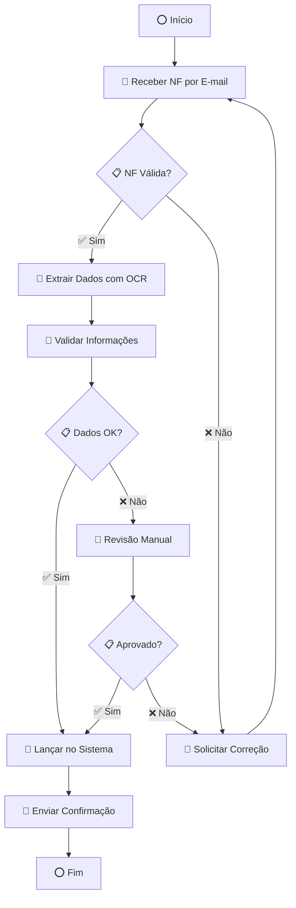

#### Ferramentas para criar BPMN:

| Ferramenta               | Tipo    | Preço    | Dificuldade  | Recomendação                 |
| ------------------------ | ------- | -------- | ------------ | ---------------------------- |
| **Bizagi Modeler**       | Desktop | Gratuito | ⭐ Fácil      | ⭐⭐⭐⭐⭐ Melhor para iniciantes |
| **Lucidchart**           | Online  | Pago     | ⭐⭐ Médio     | ⭐⭐⭐⭐ Muito intuitivo         |
| **Draw.io/Diagrams.net** | Online  | Gratuito | ⭐⭐ Médio     | ⭐⭐⭐⭐ Completo e gratuito     |
| **Camunda Modeler**      | Desktop | Gratuito | ⭐⭐⭐ Avançado | ⭐⭐⭐ Profissional             |
| **Microsoft Visio**      | Desktop | Pago     | ⭐⭐ Médio     | ⭐⭐⭐ Corporativo              |

#### BPMN no Fluxo de Desenvolvimento RPA:


#### Marcação de Tarefas no BPMN:

**👤 Tarefas Manuais:**
```
👤 Revisar documento
👤 Aprovar solicitação
👤 Tomar decisão
```

**🤖 Tarefas Automatizadas:**
```
🤖 Extrair dados do PDF
🤖 Validar informações
🤖 Enviar e-mail
🤖 Atualizar sistema
```

**🤝 Tarefas Híbridas:**
```
🤝 Bot prepara + Humano valida
🤝 Humano inicia + Bot processa
🤝 Bot executa + Humano monitora
```

---

## Toolbox do MuleSoft RPA Builder

A **Toolbox** é o coração do MuleSoft RPA Builder, contendo todas as ações (Action Steps) organizadas em categorias específicas. Cada categoria oferece funcionalidades distintas para atender às diversas necessidades de automação.

### 🎯 Estrutura da Toolbox

```
Toolbox
├── 🖥️ App Automation
├── ✅ Checks
├── 🎛️ Control
├── 📄 Document Processing
├── 📊 Excel Operations
├── 📁 File Operations
├── 🔄 Flow Control
├── 🔧 General
├── 📧 Mail Operations
├── 📏 Measurement Points
├── 🌐 Network
├── ⚙️ System
├── 👁️ Text Recognition
├── 🔢 Variable Handling
└── 🌍 Web Automation
```

---

### 🖥️ 1. App Automation

#### Descrição:
Permite interagir diretamente com elementos de aplicativos por meio de seus **XPaths**, garantindo que as automações sejam resilientes a mudanças na interface do usuário.

#### Ações Disponíveis:

| Ação | Descrição | Uso Comum |
|------|-----------|-----------|
| **Start App Session** | Inicia sessão com aplicativo | Abrir Excel, Word, SAP |
| **Set Text to App Element** | Insere texto em campo | Preencher formulários |
| **Click App Element** | Clica em elemento | Botões, links, menus |
| **Get Text from App Element** | Extrai texto de elemento | Ler valores, status |
| **Wait for App Element** | Aguarda elemento aparecer | Sincronização |
| **Take Screenshot** | Captura tela do aplicativo | Debug, documentação |

#### Parâmetros Principais:

```json
{
  "app_session": {
    "application_path": "C:\\Program Files\\Microsoft Office\\Excel.exe",
    "window_title": "Microsoft Excel",
    "timeout": 30
  },
  "xpath": {
    "element_xpath": "//input[@id='username']",
    "wait_timeout": 10,
    "retry_count": 3
  }
}
```

#### Exemplo Prático - Automação do Excel:

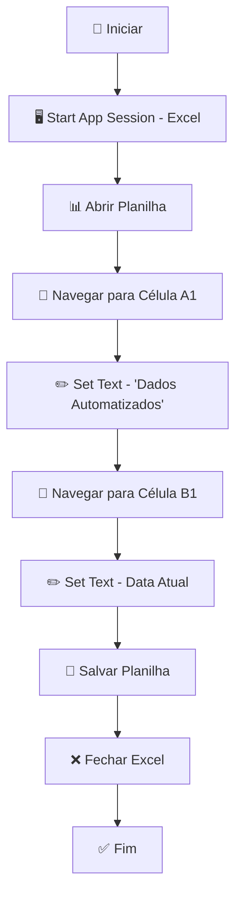

**Configuração XPath:**
```xml
<!-- Célula A1 no Excel -->
//div[@class='cell' and @data-address='A1']

<!-- Campo de entrada -->
//input[@type='text' and @placeholder='Digite aqui']

<!-- Botão Salvar -->
//button[contains(@class,'save-button')]
```

#### Boas Práticas:

✅ **Use XPaths robustos:**
```xml
<!-- ❌ Frágil -->
//div[1]/span[2]/button

<!-- ✅ Robusto -->
//button[@id='save-btn' or contains(@class,'save')]
```

✅ **Implemente timeouts:**
```json
{
  "wait_timeout": 10,
  "retry_interval": 1,
  "max_retries": 3
}
```

✅ **Trate exceções:**
```json
{
  "error_handling": {
    "element_not_found": "continue",
    "timeout": "retry",
    "application_error": "stop"
  }
}
```

#### Casos de Uso Comuns:

1. **Preenchimento de Formulários SAP**
2. **Automação de Aplicações Desktop**
3. **Interação com Sistemas Legados**
4. **Automação de Ferramentas Office**

---

### ✅ 2. Checks

#### Descrição:
Fornece ações para verificar condições específicas durante a execução do fluxo de trabalho, como existência de arquivos, presença de texto ou validação de dados.

#### Ações Disponíveis:

| Ação | Descrição | Uso Comum |
|------|-----------|-----------|
| **Check if File Exists** | Verifica existência de arquivo | Validação de entrada |
| **Check if Text Exists** | Verifica presença de texto | Validação de conteúdo |
| **Check if Element Exists** | Verifica elemento na tela | Sincronização de UI |
| **Check Variable Value** | Valida valor de variável | Lógica condicional |
| **Check Database Record** | Verifica registro no BD | Validação de dados |
| **Check Network Connection** | Testa conectividade | Validação de rede |

#### Parâmetros Principais:

```json
{
  "file_check": {
    "file_path": "C:\\Data\\input\\arquivo.xlsx",
    "check_type": "exists",
    "timeout": 5
  },
  "text_check": {
    "text_to_find": "Processo concluído",
    "case_sensitive": false,
    "search_area": "entire_screen"
  },
  "variable_check": {
    "variable_name": "status",
    "expected_value": "success",
    "comparison_type": "equals"
  }
}
```

#### Exemplo Prático - Validação de Processo:

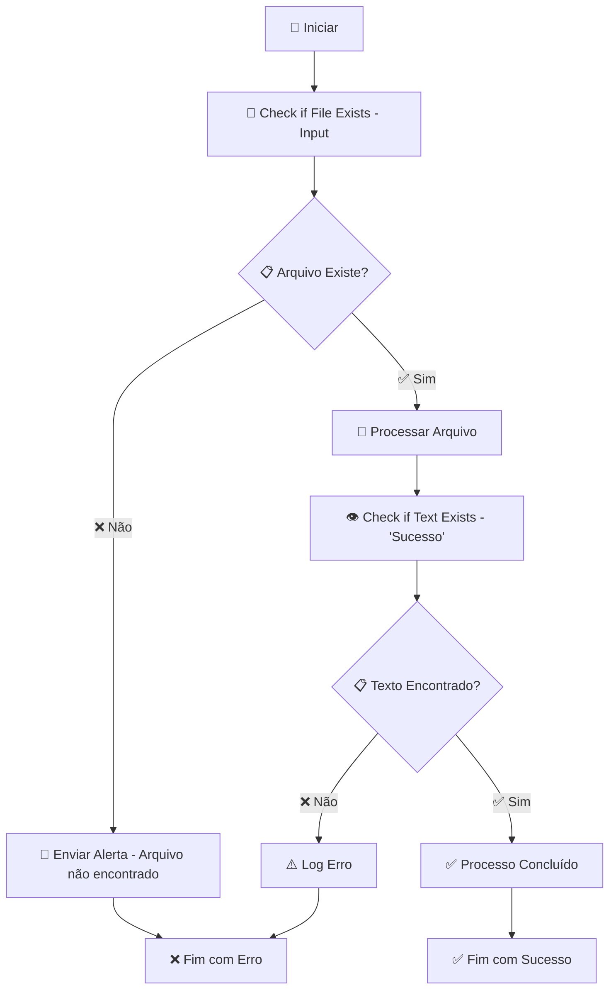

**Configuração de Check:**
```json
{
  "validation_checks": [
    {
      "name": "input_file_exists",
      "type": "file_exists",
      "path": "${input_directory}\\${file_name}",
      "on_failure": "send_alert"
    },
    {
      "name": "process_success",
      "type": "text_exists",
      "text": "Processamento concluído com sucesso",
      "timeout": 30,
      "on_failure": "retry"
    }
  ]
}
```

#### Boas Práticas:

✅ **Use checks defensivos:**
```json
{
  "defensive_checks": [
    "file_exists_before_processing",
    "disk_space_available",
    "network_connectivity",
    "application_ready"
  ]
}
```

✅ **Implemente fallbacks:**
```json
{
  "check_failure_actions": {
    "file_not_found": "create_empty_file",
    "text_not_found": "wait_and_retry",
    "connection_failed": "use_backup_server"
  }
}
```

#### Casos de Uso Comuns:

1. **Validação de Arquivos de Entrada**
2. **Verificação de Status de Processo**
3. **Validação de Conectividade**
4. **Checks de Integridade de Dados**

---

### 🎛️ 3. Control

#### Descrição:
Inclui ações para controlar o fluxo de execução, como iniciar/parar processos, aguardar eventos, manipular janelas de aplicativos e gerenciar sessões.

#### Ações Disponíveis:

| Ação | Descrição | Uso Comum |
|------|-----------|-----------|
| **Start Process** | Inicia processo do sistema | Abrir aplicações |
| **Stop Process** | Finaliza processo | Fechar aplicações |
| **Wait for Window** | Aguarda janela aparecer | Sincronização |
| **Close Window** | Fecha janela específica | Limpeza |
| **Minimize Window** | Minimiza janela | Organização |
| **Maximize Window** | Maximiza janela | Foco |
| **Set Window Position** | Posiciona janela | Layout |

#### Parâmetros Principais:

```json
{
  "process_control": {
    "process_name": "notepad.exe",
    "arguments": ["C:\\temp\\arquivo.txt"],
    "working_directory": "C:\\temp",
    "wait_for_completion": false
  },
  "window_control": {
    "window_title": "Calculadora",
    "window_class": "CalcFrame",
    "timeout": 10,
    "action": "maximize"
  }
}
```

#### Exemplo Prático - Controle de Aplicação:

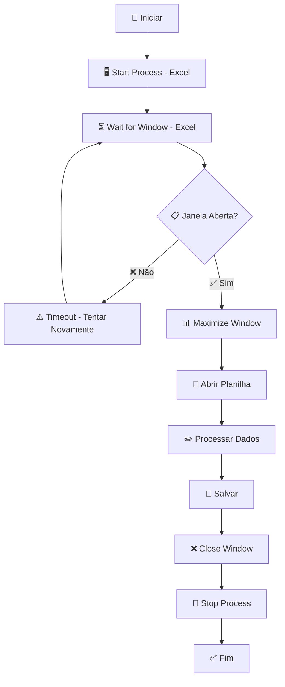

**Configuração de Controle:**
```json
{
  "application_control": {
    "startup": {
      "process": "excel.exe",
      "arguments": ["/e"],
      "wait_for_window": true,
      "window_timeout": 30
    },
    "shutdown": {
      "close_window": true,
      "force_kill": false,
      "save_prompt": "auto_save"
    }
  }
}
```

#### Boas Práticas:

✅ **Sempre aguarde janelas:**
```json
{
  "window_sync": {
    "wait_for_window": true,
    "timeout": 30,
    "retry_interval": 1
  }
}
```

✅ **Implemente cleanup:**
```json
{
  "cleanup_actions": [
    "close_all_windows",
    "stop_processes",
    "clear_temp_files"
  ]
}
```

#### Casos de Uso Comuns:

1. **Gerenciamento de Aplicações Desktop**
2. **Controle de Sessões de Usuário**
3. **Orquestração de Múltiplos Processos**
4. **Limpeza Automática de Recursos**

---

### 📄 4. Document Processing

#### Descrição:
Oferece ações para manipulação de documentos, incluindo leitura, escrita e extração de dados de arquivos PDF, Word, imagens e outros formatos.

#### Ações Disponíveis:

| Ação | Descrição | Uso Comum |
|------|-----------|-----------|
| **Read PDF** | Lê conteúdo de PDF | Extração de dados |
| **Extract Text from PDF** | Extrai texto específico | Processamento de documentos |
| **Convert PDF to Text** | Converte PDF para texto | Análise de conteúdo |
| **Read Word Document** | Lê documento Word | Processamento de textos |
| **Extract Images from PDF** | Extrai imagens do PDF | Processamento de anexos |
| **Merge PDFs** | Combina múltiplos PDFs | Consolidação |
| **Split PDF** | Divide PDF em páginas | Processamento individual |

#### Parâmetros Principais:

```json
{
  "pdf_processing": {
    "file_path": "C:\\Documents\\nota_fiscal.pdf",
    "extraction_mode": "text_and_tables",
    "ocr_enabled": true,
    "language": "pt-BR"
  },
  "text_extraction": {
    "search_patterns": [
      "Número da NF: (\\d+)",
      "Valor Total: R\\$ (\\d+,\\d+)",
      "Data: (\\d{2}/\\d{2}/\\d{4})"
    ],
    "output_format": "json"
  }
}
```

#### Exemplo Prático - Processamento de Nota Fiscal:

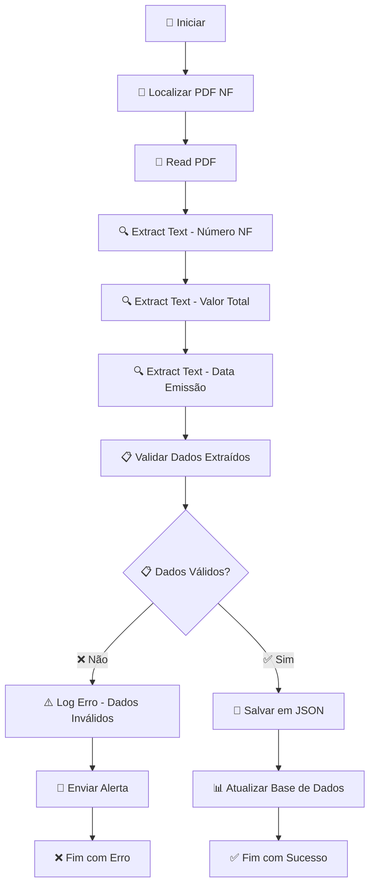

**Configuração de Extração:**
```json
{
  "document_processing": {
    "input": {
      "file_path": "${input_directory}\\${file_name}",
      "supported_formats": ["pdf", "docx", "txt"]
    },
    "extraction": {
      "patterns": {
        "nf_number": "NF[\\s]*[Nn]úmero[\\s]*:?[\\s]*(\\d+)",
        "total_value": "Total[\\s]*:?[\\s]*R\\$[\\s]*(\\d+[.,]\\d+)",
        "issue_date": "Data[\\s]*[Ee]missão[\\s]*:?[\\s]*(\\d{2}/\\d{2}/\\d{4})",
        "supplier": "Fornecedor[\\s]*:?[\\s]*([A-Za-z\\s]+)"
      },
      "ocr_settings": {
        "enabled": true,
        "language": "por",
        "confidence_threshold": 0.8
      }
    },
    "output": {
      "format": "json",
      "file_path": "${output_directory}\\${file_name}.json"
    }
  }
}
```

#### Boas Práticas:

✅ **Use OCR quando necessário:**
```json
{
  "ocr_config": {
    "enabled": true,
    "language": "por",
    "confidence_threshold": 0.8,
    "preprocessing": ["deskew", "noise_reduction"]
  }
}
```

✅ **Valide dados extraídos:**
```json
{
  "validation_rules": {
    "nf_number": "required|numeric|min:1",
    "total_value": "required|numeric|min:0",
    "issue_date": "required|date_format:dd/MM/yyyy"
  }
}
```

#### Casos de Uso Comuns:

1. **Processamento de Notas Fiscais**
2. **Extração de Dados de Contratos**
3. **Processamento de Relatórios**
4. **Digitalização de Documentos**

---

### 📊 5. Excel Operations

#### Descrição:
Contém ações específicas para interagir com planilhas do Excel, permitindo leitura, escrita, manipulação de dados e formatação.

#### Ações Disponíveis:

| Ação | Descrição | Uso Comum |
|------|-----------|-----------|
| **Open Excel File** | Abre arquivo Excel | Inicialização |
| **Read Cell Value** | Lê valor de célula | Extração de dados |
| **Write Cell Value** | Escreve valor em célula | Inserção de dados |
| **Read Range** | Lê intervalo de células | Processamento em lote |
| **Write Range** | Escreve intervalo de células | Inserção em lote |
| **Create Worksheet** | Cria nova planilha | Organização |
| **Format Cells** | Formata células | Apresentação |
| **Apply Formula** | Aplica fórmula | Cálculos |

#### Parâmetros Principais:

```json
{
  "excel_operations": {
    "file_path": "C:\\Reports\\vendas.xlsx",
    "worksheet": "Dados",
    "cell_reference": "A1",
    "range": "A1:Z100"
  },
  "data_operations": {
    "read_mode": "values_only",
    "write_mode": "overwrite",
    "format_preservation": true
  }
}
```

#### Exemplo Prático - Relatório de Vendas:

```mermaid
graph TD
    A[🚀 Iniciar] --> B[📊 Open Excel File]
    B --> C[📋 Create Worksheet - 'Relatório']"
    C --> D[📊 Write Range - Cabeçalhos]
    D --> E[🔄 Loop - Para cada venda]
    E --> F[📊 Write Cell - Data]
    F --> G[📊 Write Cell - Cliente]
    G --> H[📊 Write Cell - Valor]
    H --> I[📊 Write Cell - Status]
    I --> J{📋 Mais vendas?}
    J -->|✅ Sim| E
    J -->|❌ Não| K[📊 Apply Formula - Soma Total]
    K --> L[🎨 Format Cells - Moeda]
    L --> M[💾 Save Excel File]
    M --> N[❌ Close Excel]
    N --> O[✅ Fim]
```

**Configuração Excel:**
```json
{
  "excel_config": {
    "file_settings": {
      "file_path": "${reports_directory}\\vendas_${date}.xlsx",
      "backup_enabled": true,
      "auto_save": true
    },
    "worksheet_config": {
      "default_sheet": "Dados",
      "headers": ["Data", "Cliente", "Produto", "Valor", "Status"],
      "data_start_row": 2
    },
    "formatting": {
      "currency_format": "R$ #,##0.00",
      "date_format": "dd/mm/yyyy",
      "header_style": "bold|center|background_color:lightblue"
    },
    "formulas": {
      "total_sum": "SUM(E2:E1000)",
      "average_value": "AVERAGE(E2:E1000)",
      "count_records": "COUNTA(A2:A1000)"
    }
  }
}
```

#### Boas Práticas:

✅ **Use ranges para performance:**
```json
{
  "batch_operations": {
    "read_range": "A1:Z1000",
    "write_range": "A1:Z1000",
    "batch_size": 100
  }
}
```

✅ **Implemente formatação consistente:**
```json
{
  "formatting_standards": {
    "headers": "bold|center|background:lightblue",
    "currency": "R$ #,##0.00",
    "dates": "dd/mm/yyyy",
    "numbers": "#,##0.00"
  }
}
```

#### Casos de Uso Comuns:

1. **Geração de Relatórios**
2. **Consolidação de Dados**
3. **Análise de Planilhas**
4. **Migração de Dados**

---

### 📁 6. File Operations

#### Descrição:
Inclui ações para manipulação de arquivos e diretórios, como copiar, mover, excluir, renomear e organizar arquivos.

#### Ações Disponíveis:

| Ação | Descrição | Uso Comum |
|------|-----------|-----------|
| **Copy File** | Copia arquivo | Backup, duplicação |
| **Move File** | Move arquivo | Organização |
| **Delete File** | Exclui arquivo | Limpeza |
| **Rename File** | Renomeia arquivo | Padronização |
| **Create Directory** | Cria diretório | Organização |
| **List Files** | Lista arquivos | Processamento em lote |
| **Get File Info** | Obtém informações | Validação |
| **Compress Files** | Compacta arquivos | Otimização |

#### Parâmetros Principais:

```json
{
  "file_operations": {
    "source_path": "C:\\Input\\arquivo.pdf",
    "destination_path": "C:\\Processed\\arquivo.pdf",
    "overwrite": true,
    "create_directories": true
  },
  "directory_operations": {
    "directory_path": "C:\\Reports\\2024",
    "recursive": true,
    "include_subdirectories": true
  }
}
```

#### Exemplo Prático - Organização de Arquivos:

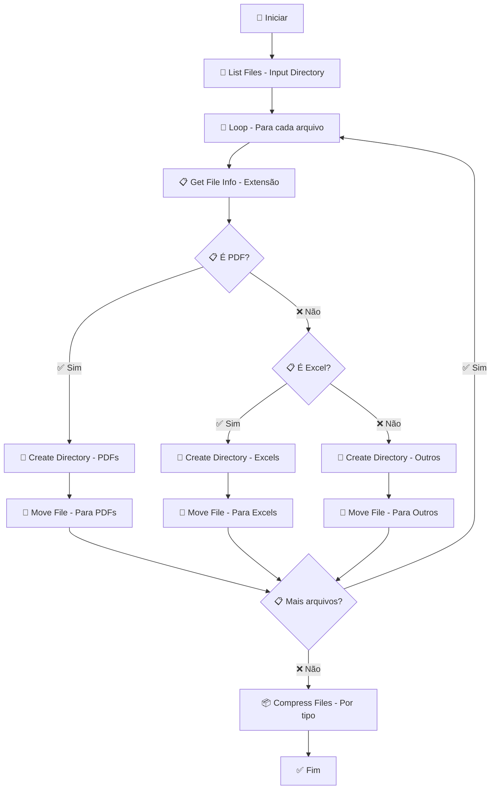

**Configuração de Organização:**
```json
{
  "file_organization": {
    "source_directory": "${input_directory}",
    "organization_rules": {
      "pdf_files": {
        "pattern": "*.pdf",
        "destination": "${processed_directory}\\PDFs\\${date}",
        "action": "move"
      },
      "excel_files": {
        "pattern": "*.xlsx,*.xls",
        "destination": "${processed_directory}\\Excels\\${date}",
        "action": "move"
      },
      "image_files": {
        "pattern": "*.jpg,*.png,*.gif",
        "destination": "${processed_directory}\\Images\\${date}",
        "action": "move"
      }
    },
    "cleanup": {
      "empty_directories": true,
      "temp_files": true,
      "old_files_days": 30
    }
  }
}
```

#### Boas Práticas:

✅ **Use caminhos absolutos:**
```json
{
  "path_config": {
    "use_absolute_paths": true,
    "base_directory": "C:\\RPA\\Data",
    "create_missing_dirs": true
  }
}
```

✅ **Implemente backup:**
```json
{
  "backup_strategy": {
    "backup_before_move": true,
    "backup_directory": "${backup_directory}\\${date}",
    "retention_days": 7
  }
}
```

#### Casos de Uso Comuns:

1. **Organização Automática de Arquivos**
2. **Backup e Arquivamento**
3. **Limpeza de Diretórios**
4. **Migração de Arquivos**

---

### 🔄 7. Flow Control

#### Descrição:
Fornece ações para controlar a lógica do fluxo de trabalho, incluindo loops, condições, tratamento de exceções e ramificações.

#### Ações Disponíveis:

| Ação | Descrição | Uso Comum |
|------|-----------|-----------|
| **If Condition** | Executa condição | Decisões |
| **Loop** | Repete ações | Processamento em lote |
| **For Each** | Itera sobre lista | Processamento de itens |
| **While Loop** | Loop condicional | Aguarda condição |
| **Try Catch** | Tratamento de erro | Robustez |
| **Switch Case** | Múltiplas condições | Classificação |
| **Break** | Sai do loop | Controle de fluxo |
| **Continue** | Próxima iteração | Pula item |

#### Parâmetros Principais:

```json
{
  "flow_control": {
    "condition": "${status} == 'success'",
    "loop_type": "for_each",
    "collection": "${file_list}",
    "max_iterations": 100
  },
  "error_handling": {
    "try_catch_enabled": true,
    "retry_count": 3,
    "retry_interval": 5
  }
}
```

#### Exemplo Prático - Processamento com Validações:

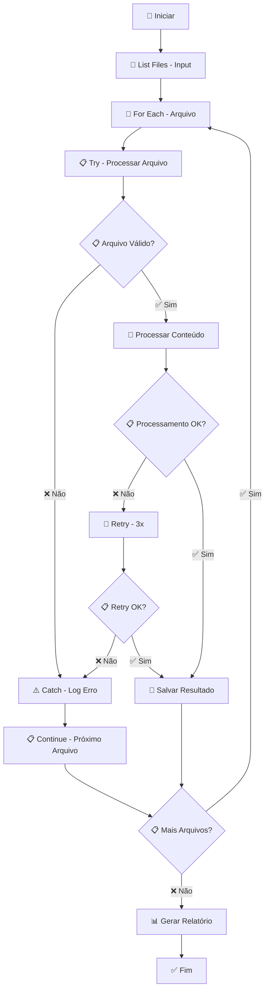

**Configuração de Fluxo:**
```json
{
  "flow_control_config": {
    "main_loop": {
      "type": "for_each",
      "collection": "${input_files}",
      "max_iterations": 1000,
      "break_on_error": false
    },
    "conditions": {
      "file_validation": {
        "condition": "${file_extension} in ['pdf', 'xlsx', 'docx']",
        "true_action": "process_file",
        "false_action": "skip_file"
      },
      "processing_status": {
        "condition": "${processing_result.status} == 'success'",
        "true_action": "save_result",
        "false_action": "retry_processing"
      }
    },
    "error_handling": {
      "try_catch": {
        "enabled": true,
        "catch_all": true,
        "log_errors": true
      },
      "retry_logic": {
        "max_retries": 3,
        "retry_interval": 5,
        "exponential_backoff": true
      }
    }
  }
}
```

#### Boas Práticas:

✅ **Use condições claras:**
```json
{
  "clear_conditions": {
    "use_descriptive_variables": true,
    "avoid_complex_expressions": true,
    "document_conditions": true
  }
}
```

✅ **Implemente tratamento de erro robusto:**
```json
{
  "robust_error_handling": {
    "try_catch_blocks": true,
    "specific_exceptions": true,
    "graceful_degradation": true,
    "comprehensive_logging": true
  }
}
```

#### Casos de Uso Comuns:

1. **Processamento em Lote com Validações**
2. **Loops Condicionais**
3. **Tratamento de Exceções**
4. **Fluxos de Decisão Complexos**

---

### 🔧 8. General

#### Descrição:
Contém ações de uso geral que não se enquadram em outras categorias, como pausas, execução de scripts, logging e utilitários diversos.

#### Ações Disponíveis:

| Ação | Descrição | Uso Comum |
|------|-----------|-----------|
| **Wait** | Pausa execução | Sincronização |
| **Log Message** | Registra mensagem | Debug, auditoria |
| **Execute Script** | Executa script | Automação customizada |
| **Show Message** | Exibe mensagem | Notificação |
| **Get Current Time** | Obtém data/hora | Timestamps |
| **Generate Random** | Gera valor aleatório | Testes, IDs |
| **Sleep** | Pausa específica | Controle de timing |
| **Comment** | Comentário | Documentação |

#### Parâmetros Principais:

```json
{
  "general_operations": {
    "wait_time": 5,
    "log_level": "INFO",
    "message": "Processo iniciado",
    "script_path": "C:\\Scripts\\custom.py"
  },
  "timing": {
    "sleep_duration": 2,
    "timeout": 30,
    "retry_interval": 1
  }
}
```

#### Exemplo Prático - Utilitários Gerais:

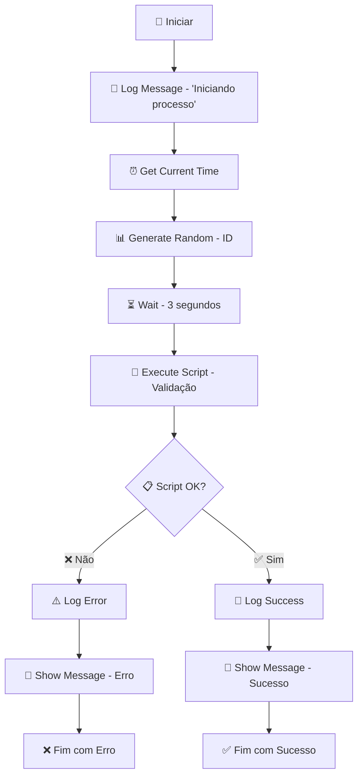

**Configuração de Utilitários:**
```json
{
  "general_config": {
    "logging": {
      "enabled": true,
      "level": "INFO",
      "format": "${timestamp} - ${level} - ${message}",
      "file_path": "${logs_directory}\\process_${date}.log"
    },
    "timing": {
      "default_wait": 2,
      "max_timeout": 300,
      "retry_intervals": [1, 2, 5, 10]
    },
    "scripts": {
      "python_path": "C:\\Python\\python.exe",
      "script_directory": "${scripts_directory}",
      "timeout": 60
    },
    "notifications": {
      "show_messages": true,
      "message_timeout": 5,
      "log_notifications": true
    }
  }
}
```

#### Boas Práticas:

✅ **Use logging consistente:**
```json
{
  "logging_standards": {
    "format": "${timestamp} [${level}] ${component}: ${message}",
    "levels": ["DEBUG", "INFO", "WARN", "ERROR"],
    "rotation": "daily"
  }
}
```

✅ **Implemente timeouts apropriados:**
```json
{
  "timeout_strategy": {
    "short_operations": 10,
    "medium_operations": 60,
    "long_operations": 300,
    "network_operations": 30
  }
}
```

#### Casos de Uso Comuns:

1. **Logging e Auditoria**
2. **Sincronização de Timing**
3. **Execução de Scripts Customizados**
4. **Utilitários Gerais**

---

### 📧 9. Mail Operations

#### Descrição:
Oferece ações para interagir com clientes de e-mail, permitindo envio, recebimento e processamento de mensagens.

#### Ações Disponíveis:

| Ação | Descrição | Uso Comum |
|------|-----------|-----------|
| **Send Mail** | Envia e-mail | Notificações |
| **Read Mail** | Lê e-mail | Processamento |
| **Download Attachments** | Baixa anexos | Processamento de arquivos |
| **Move Mail** | Move e-mail | Organização |
| **Delete Mail** | Exclui e-mail | Limpeza |
| **Search Mail** | Busca e-mails | Filtragem |
| **Reply to Mail** | Responde e-mail | Automação de resposta |
| **Forward Mail** | Encaminha e-mail | Distribuição |

#### Parâmetros Principais:

```json
{
  "mail_operations": {
    "server": "smtp.company.com",
    "port": 587,
    "username": "${email_user}",
    "password": "${email_password}",
    "use_ssl": true
  },
  "message": {
    "to": "user@company.com",
    "subject": "Relatório Processado",
    "body": "O relatório foi processado com sucesso.",
    "attachments": ["C:\\Reports\\report.xlsx"]
  }
}
```

#### Exemplo Prático - Processamento de E-mails:

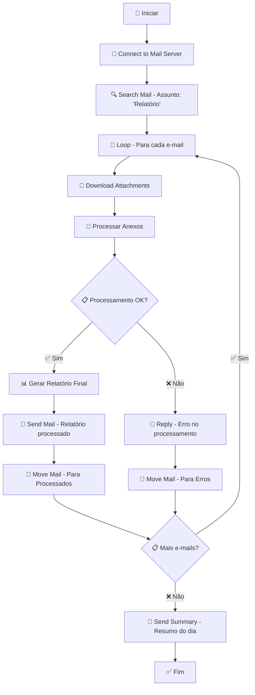

**Configuração de E-mail:**
```json
{
  "mail_config": {
    "smtp": {
      "server": "${smtp_server}",
      "port": 587,
      "username": "${email_username}",
      "password": "${email_password}",
      "use_ssl": true,
      "use_tls": true
    },
    "imap": {
      "server": "${imap_server}",
      "port": 993,
      "username": "${email_username}",
      "password": "${email_password}",
      "use_ssl": true
    },
    "templates": {
      "success_notification": {
        "subject": "Processamento Concluído - ${process_name}",
        "body": "O processo ${process_name} foi executado com sucesso em ${timestamp}.",
        "attachments": ["${output_file}"]
      },
      "error_notification": {
        "subject": "Erro no Processamento - ${process_name}",
        "body": "Ocorreu um erro no processo ${process_name}: ${error_message}",
        "priority": "high"
      }
    }
  }
}
```

#### Boas Práticas:

✅ **Use templates de e-mail:**
```json
{
  "email_templates": {
    "success": "Processo ${process} concluído com sucesso",
    "error": "Erro no processo ${process}: ${error}",
    "warning": "Atenção no processo ${process}: ${warning}"
  }
}
```

✅ **Implemente filtros de segurança:**
```json
{
  "security_filters": {
    "allowed_senders": ["system@company.com", "admin@company.com"],
    "blocked_extensions": [".exe", ".bat", ".scr"],
    "max_attachment_size": "10MB"
  }
}
```

#### Casos de Uso Comuns:

1. **Notificações Automáticas**
2. **Processamento de Anexos**
3. **Automação de Respostas**
4. **Distribuição de Relatórios**

---

### 📏 10. Measurement Points

#### Descrição:
Inclui ações para medir o tempo de execução de partes específicas do fluxo de trabalho, útil para análise de desempenho e otimização.

#### Ações Disponíveis:

| Ação | Descrição | Uso Comum |
|------|-----------|-----------|
| **Start Measurement** | Inicia medição | Benchmarking |
| **End Measurement** | Finaliza medição | Análise de performance |
| **Log Measurement** | Registra métrica | Monitoramento |
| **Get Elapsed Time** | Obtém tempo decorrido | Controle de timing |
| **Reset Timer** | Reinicia timer | Múltiplas medições |
| **Compare Measurements** | Compara métricas | Análise comparativa |

#### Parâmetros Principais:

```json
{
  "measurement": {
    "measurement_name": "process_duration",
    "start_time": "${current_timestamp}",
    "end_time": "${current_timestamp}",
    "unit": "seconds"
  },
  "performance": {
    "threshold_warning": 30,
    "threshold_error": 60,
    "log_level": "INFO"
  }
}
```

#### Exemplo Prático - Análise de Performance:

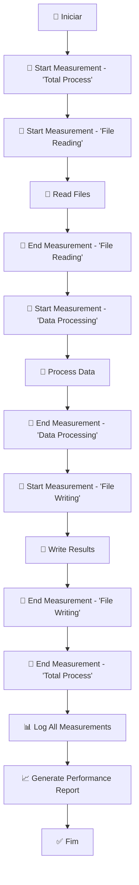

**Configuração de Medição:**
```json
{
  "measurement_config": {
    "measurements": {
      "total_process": {
        "name": "Total Process Duration",
        "unit": "seconds",
        "threshold_warning": 300,
        "threshold_error": 600
      },
      "file_operations": {
        "name": "File Operations",
        "unit": "seconds",
        "threshold_warning": 60,
        "threshold_error": 120
      },
      "data_processing": {
        "name": "Data Processing",
        "unit": "seconds",
        "threshold_warning": 180,
        "threshold_error": 300
      }
    },
    "reporting": {
      "generate_report": true,
      "report_format": "json",
      "include_details": true,
      "send_alerts": true
    }
  }
}
```

#### Boas Práticas:

✅ **Meça componentes críticos:**
```json
{
  "critical_measurements": [
    "total_process_time",
    "file_io_operations",
    "network_operations",
    "database_operations"
  ]
}
```

✅ **Implemente alertas de performance:**
```json
{
  "performance_alerts": {
    "warning_threshold": 30,
    "error_threshold": 60,
    "alert_recipients": ["admin@company.com"],
    "include_details": true
  }
}
```

#### Casos de Uso Comuns:

1. **Análise de Performance**
2. **Benchmarking de Processos**
3. **Otimização de Fluxos**
4. **Monitoramento de SLA**

---

### 🌐 11. Network

#### Descrição:
Fornece ações para interações relacionadas à rede, como downloads, uploads, chamadas HTTP e comunicação com APIs.

#### Ações Disponíveis:

| Ação | Descrição | Uso Comum |
|------|-----------|-----------|
| **Download File** | Baixa arquivo | Obter dados remotos |
| **Upload File** | Envia arquivo | Envio de resultados |
| **HTTP Request** | Requisição HTTP | Integração com APIs |
| **FTP Operations** | Operações FTP | Transferência de arquivos |
| **Ping Host** | Testa conectividade | Validação de rede |
| **Check URL** | Verifica URL | Validação de links |
| **Web Service Call** | Chama web service | Integração de sistemas |

#### Parâmetros Principais:

```json
{
  "network_operations": {
    "url": "https://api.company.com/data",
    "method": "GET",
    "headers": {
      "Authorization": "Bearer ${token}",
      "Content-Type": "application/json"
    },
    "timeout": 30
  },
  "file_transfer": {
    "source_url": "https://files.company.com/data.xlsx",
    "destination_path": "C:\\Downloads\\data.xlsx",
    "overwrite": true
  }
}
```

#### Exemplo Prático - Integração com API:

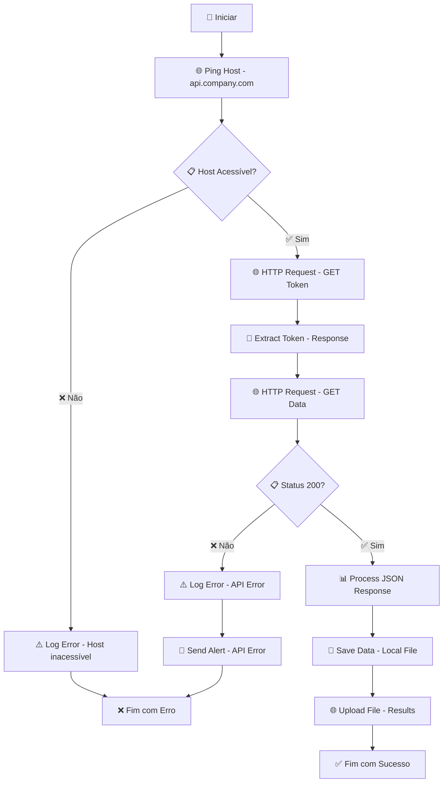

**Configuração de Rede:**
```json
{
  "network_config": {
    "http_settings": {
      "timeout": 30,
      "retry_count": 3,
      "retry_interval": 5,
      "user_agent": "MuleSoft-RPA-Bot/1.0"
    },
    "authentication": {
      "type": "bearer_token",
      "token_endpoint": "https://api.company.com/auth/token",
      "credentials": {
        "client_id": "${client_id}",
        "client_secret": "${client_secret}"
      }
    },
    "endpoints": {
      "data_endpoint": "https://api.company.com/v1/data",
      "upload_endpoint": "https://api.company.com/v1/upload",
      "status_endpoint": "https://api.company.com/v1/status"
    },
    "file_transfer": {
      "max_file_size": "100MB",
      "supported_formats": ["json", "xml", "csv", "xlsx"],
      "compression": true
    }
  }
}
```

#### Boas Práticas:

✅ **Implemente retry logic:**
```json
{
  "retry_strategy": {
    "max_retries": 3,
    "retry_interval": 5,
    "exponential_backoff": true,
    "retry_on_status": [500, 502, 503, 504]
  }
}
```

✅ **Use timeouts apropriados:**
```json
{
  "timeout_settings": {
    "connection_timeout": 10,
    "read_timeout": 30,
    "total_timeout": 60
  }
}
```

#### Casos de Uso Comuns:

1. **Integração com APIs REST**
2. **Download/Upload de Arquivos**
3. **Sincronização de Dados**
4. **Comunicação entre Sistemas**

---

### ⚙️ 12. System

#### Descrição:
Inclui ações para interagir com o sistema operacional, como executar comandos, manipular processos, acessar variáveis de ambiente e operações do sistema.

#### Ações Disponíveis:

| Ação | Descrição | Uso Comum |
|------|-----------|-----------|
| **Execute Command** | Executa comando | Automação de sistema |
| **Get Environment Variable** | Obtém variável de ambiente | Configuração |
| **Set Environment Variable** | Define variável de ambiente | Configuração dinâmica |
| **Kill Process** | Finaliza processo | Limpeza de sistema |
| **Get Process List** | Lista processos | Monitoramento |
| **Get System Info** | Obtém informações do sistema | Diagnóstico |
| **Restart Service** | Reinicia serviço | Manutenção |
| **Check Disk Space** | Verifica espaço em disco | Validação de recursos |

#### Parâmetros Principais:

```json
{
  "system_operations": {
    "command": "dir C:\\Data",
    "working_directory": "C:\\",
    "timeout": 30,
    "capture_output": true
  },
  "environment": {
    "variable_name": "RPA_CONFIG_PATH",
    "variable_value": "C:\\RPA\\Config",
    "scope": "process"
  }
}
```

#### Exemplo Prático - Manutenção do Sistema:

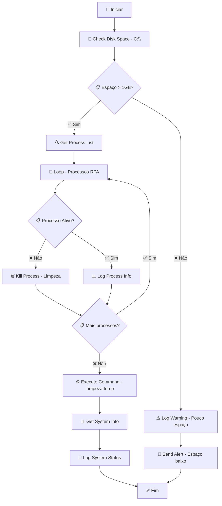

**Configuração do Sistema:**
```json
{
  "system_config": {
    "disk_monitoring": {
      "check_interval": 300,
      "warning_threshold": "1GB",
      "critical_threshold": "500MB",
      "monitored_drives": ["C:", "D:"]
    },
    "process_management": {
      "monitored_processes": ["excel.exe", "notepad.exe", "chrome.exe"],
      "max_runtime": 3600,
      "auto_cleanup": true
    },
    "system_commands": {
      "cleanup_temp": "del /q /s C:\\temp\\*.*",
      "clear_cache": "ipconfig /flushdns",
      "restart_service": "net stop \"Service Name\" && net start \"Service Name\""
    },
    "environment_variables": {
      "RPA_HOME": "C:\\RPA",
      "RPA_CONFIG": "C:\\RPA\\Config",
      "RPA_LOGS": "C:\\RPA\\Logs",
      "RPA_DATA": "C:\\RPA\\Data"
    }
  }
}
```

#### Boas Práticas:

✅ **Use comandos seguros:**
```json
{
  "safe_commands": {
    "whitelist": ["dir", "type", "echo", "ping"],
    "blacklist": ["format", "del /f", "rmdir /s"],
    "require_confirmation": true
  }
}
```

✅ **Implemente monitoramento de recursos:**
```json
{
  "resource_monitoring": {
    "cpu_threshold": 80,
    "memory_threshold": 85,
    "disk_threshold": 90,
    "alert_on_threshold": true
  }
}
```

#### Casos de Uso Comuns:

1. **Manutenção Automática do Sistema**
2. **Execução de Scripts de Limpeza**
3. **Monitoramento de Recursos**
4. **Configuração Dinâmica**

---

### 👁️ 13. Text Recognition

#### Descrição:
Oferece ações para reconhecimento óptico de caracteres (OCR), permitindo extrair texto de imagens, capturas de tela e documentos escaneados.

#### Ações Disponíveis:

| Ação | Descrição | Uso Comum |
|------|-----------|-----------|
| **Recognize Text** | Reconhece texto em imagem | OCR básico |
| **Extract Text from Image** | Extrai texto de imagem | Processamento de documentos |
| **OCR with Coordinates** | OCR com coordenadas | Extração precisa |
| **Batch OCR** | OCR em lote | Processamento múltiplo |
| **OCR with Language** | OCR com idioma específico | Multilíngue |
| **Validate OCR Result** | Valida resultado OCR | Controle de qualidade |
| **Preprocess Image** | Pré-processa imagem | Melhoria de qualidade |

#### Parâmetros Principais:

```json
{
  "ocr_settings": {
    "image_path": "C:\\Images\\document.png",
    "language": "por",
    "confidence_threshold": 0.8,
    "preprocessing": ["deskew", "noise_reduction"]
  },
  "text_extraction": {
    "region": {
      "x": 100,
      "y": 200,
      "width": 500,
      "height": 100
    },
    "output_format": "text"
  }
}
```

#### Exemplo Prático - OCR de Nota Fiscal:

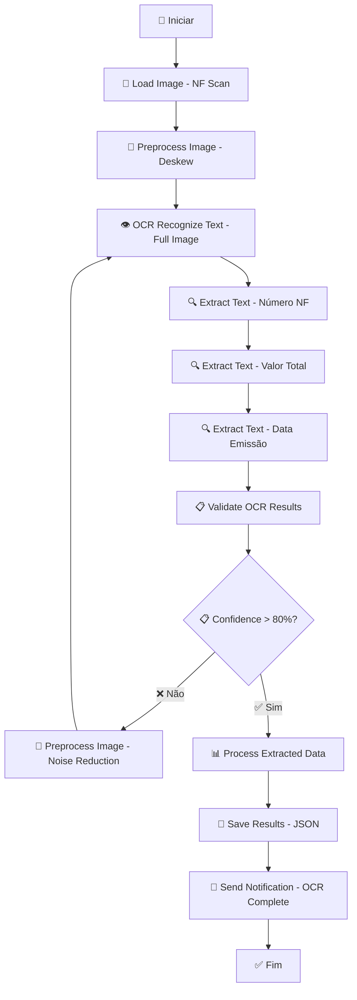

**Configuração de OCR:**
```json
{
  "ocr_config": {
    "engine": "tesseract",
    "languages": ["por", "eng"],
    "confidence_threshold": 0.8,
    "preprocessing": {
      "deskew": true,
      "noise_reduction": true,
      "contrast_enhancement": true,
      "resolution_upscaling": true
    },
    "extraction_patterns": {
      "nf_number": {
        "pattern": "NF[\\s]*[Nn]úmero[\\s]*:?[\\s]*(\\d+)",
        "region": {"x": 100, "y": 50, "width": 300, "height": 30}
      },
      "total_value": {
        "pattern": "Total[\\s]*:?[\\s]*R\\$[\\s]*(\\d+[.,]\\d+)",
        "region": {"x": 400, "y": 200, "width": 200, "height": 30}
      },
      "issue_date": {
        "pattern": "Data[\\s]*[Ee]missão[\\s]*:?[\\s]*(\\d{2}/\\d{2}/\\d{4})",
        "region": {"x": 100, "y": 100, "width": 200, "height": 30}
      }
    },
    "validation": {
      "required_fields": ["nf_number", "total_value", "issue_date"],
      "format_validation": true,
      "cross_reference_check": true
    }
  }
}
```

#### Boas Práticas:

✅ **Pré-processe imagens:**
```json
{
  "image_preprocessing": {
    "deskew": true,
    "noise_reduction": true,
    "contrast_enhancement": true,
    "resolution_optimization": true
  }
}
```

✅ **Use regiões específicas:**
```json
{
  "region_based_ocr": {
    "define_regions": true,
    "use_coordinates": true,
    "validate_regions": true
  }
}
```

#### Casos de Uso Comuns:

1. **Processamento de Documentos Escaneados**
2. **Extração de Dados de Imagens**
3. **Digitalização de Formulários**
4. **OCR de Capturas de Tela**

---

### 🔢 14. Variable Handling

#### Descrição:
Contém ações para manipulação de variáveis, incluindo criação, atribuição, conversão de tipos e operações matemáticas.

#### Ações Disponíveis:

| Ação | Descrição | Uso Comum |
|------|-----------|-----------|
| **Set Variable** | Define variável | Armazenamento de dados |
| **Get Variable** | Obtém variável | Recuperação de dados |
| **Convert Variable** | Converte tipo | Transformação de dados |
| **Calculate** | Realiza cálculo | Operações matemáticas |
| **Concatenate Strings** | Concatena strings | Formatação de texto |
| **Split String** | Divide string | Processamento de texto |
| **Format Date** | Formata data | Manipulação de datas |
| **Generate GUID** | Gera identificador único | IDs únicos |

#### Parâmetros Principais:

```json
{
  "variable_operations": {
    "variable_name": "total_amount",
    "variable_value": 1500.50,
    "data_type": "decimal",
    "scope": "process"
  },
  "string_operations": {
    "input_string": "João Silva",
    "operation": "split",
    "delimiter": " ",
    "output_variables": ["first_name", "last_name"]
  }
}
```

#### Exemplo Prático - Manipulação de Dados:

```mermaid
graph TD
    A[🚀 Iniciar] --> B[📊 Set Variable - 'total' = 0]
    B --> C[📊 Set Variable - 'count' = 0]
    C --> D[🔄 Loop - Para cada item]
    D --> E[📊 Get Variable - 'item_value']
    E --> F[🧮 Calculate - total + item_value]
    F --> G[📊 Set Variable - 'total' = resultado]
    G --> H[🧮 Calculate - count + 1]
    H --> I[📊 Set Variable - 'count' = resultado]
    I --> J{📋 Mais itens?}
    J -->|✅ Sim| D
    J -->|❌ Não| K[🧮 Calculate - total / count]
    K --> L[📊 Set Variable - 'average' = resultado]
    L --> M[📝 Format String - 'Média: R$ {average}']
    M --> N[📊 Set Variable - 'formatted_result']
    N --> O[💾 Save Variable - Para arquivo]
    O --> P[✅ Fim]
```

**Configuração de Variáveis:**
```json
{
  "variable_config": {
    "data_types": {
      "string": "texto",
      "integer": "número inteiro",
      "decimal": "número decimal",
      "boolean": "verdadeiro/falso",
      "date": "data",
      "array": "lista",
      "object": "objeto"
    },
    "operations": {
      "mathematical": ["add", "subtract", "multiply", "divide", "modulo"],
      "string": ["concatenate", "split", "replace", "substring", "uppercase", "lowercase"],
      "date": ["format", "add_days", "subtract_days", "compare"],
      "conversion": ["to_string", "to_number", "to_boolean", "to_date"]
    },
    "scopes": {
      "process": "variável do processo atual",
      "global": "variável global do sistema",
      "session": "variável da sessão atual"
    }
  }
}
```

#### Boas Práticas:

✅ **Use nomes descritivos:**
```json
{
  "naming_conventions": {
    "use_descriptive_names": true,
    "avoid_abbreviations": true,
    "use_consistent_format": "snake_case",
    "prefix_by_type": {
      "string": "str_",
      "number": "num_",
      "boolean": "bool_",
      "date": "dt_"
    }
  }
}
```

✅ **Valide tipos de dados:**
```json
{
  "type_validation": {
    "validate_on_assignment": true,
    "strict_typing": true,
    "auto_conversion": false,
    "log_type_changes": true
  }
}
```

#### Casos de Uso Comuns:

1. **Cálculos e Operações Matemáticas**
2. **Formatação de Dados**
3. **Manipulação de Strings**
4. **Conversão de Tipos**

---

### 🌍 15. Web Automation

#### Descrição:
Inclui ações específicas para automação de interações com navegadores web, como navegação, preenchimento de formulários, extração de dados e cliques.

#### Ações Disponíveis:

| Ação | Descrição | Uso Comum |
|------|-----------|-----------|
| **Open Browser** | Abre navegador | Inicialização |
| **Navigate to URL** | Navega para URL | Acesso a páginas |
| **Click Element** | Clica em elemento | Interação com botões |
| **Type Text** | Digita texto | Preenchimento de campos |
| **Get Text** | Extrai texto | Obtenção de dados |
| **Select Dropdown** | Seleciona opção | Preenchimento de listas |
| **Wait for Element** | Aguarda elemento | Sincronização |
| **Take Screenshot** | Captura tela | Debug, documentação |
| **Execute JavaScript** | Executa JS | Automação avançada |
| **Handle Alert** | Gerencia alertas | Tratamento de popups |

#### Parâmetros Principais:

```json
{
  "web_automation": {
    "browser": "chrome",
    "headless": false,
    "window_size": "1920x1080",
    "timeout": 30
  },
  "navigation": {
    "url": "https://example.com",
    "wait_for_page_load": true,
    "max_wait_time": 60
  },
  "element_interaction": {
    "selector_type": "xpath",
    "element_selector": "//input[@id='username']",
    "wait_timeout": 10,
    "retry_count": 3
  }
}
```

#### Exemplo Prático - Automação de Login:

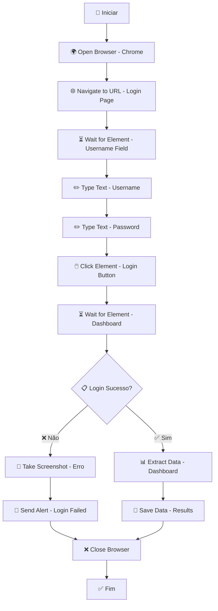

**Configuração Web:**
```json
{
  "web_config": {
    "browser_settings": {
      "browser": "chrome",
      "headless": false,
      "window_size": "1920x1080",
      "user_agent": "MuleSoft-RPA-Bot/1.0",
      "disable_images": false,
      "disable_javascript": false
    },
    "navigation": {
      "default_timeout": 30,
      "page_load_timeout": 60,
      "implicit_wait": 10,
      "explicit_wait": 15
    },
    "element_selectors": {
      "username_field": "//input[@id='username' or @name='username']",
      "password_field": "//input[@type='password']",
      "login_button": "//button[contains(text(),'Login') or @type='submit']",
      "dashboard": "//div[@class='dashboard' or contains(@id,'dashboard')]"
    },
    "error_handling": {
      "screenshot_on_error": true,
      "retry_failed_actions": true,
      "max_retries": 3,
      "retry_interval": 5
    }
  }
}
```

#### Boas Práticas:

✅ **Use seletores robustos:**
```json
{
  "robust_selectors": {
    "prefer_id_over_xpath": true,
    "use_multiple_selectors": true,
    "avoid_position_based": true,
    "test_selectors": true
  }
}
```

✅ **Implemente waits apropriados:**
```json
{
  "wait_strategy": {
    "implicit_wait": 10,
    "explicit_wait": 15,
    "page_load_wait": 30,
    "element_wait": 10
  }
}
```

#### Casos de Uso Comuns:

1. **Automação de Formulários Web**
2. **Web Scraping e Extração de Dados**
3. **Testes Automatizados de Interface**
4. **Navegação e Interação com Portais**

---

## Exemplos Práticos Completos

### 🎯 Exemplo 1: Automação de Entrada de Dados no Excel

#### Cenário:
Automatizar o preenchimento de uma planilha Excel com dados de vendas diárias.

#### Fluxo BPMN:
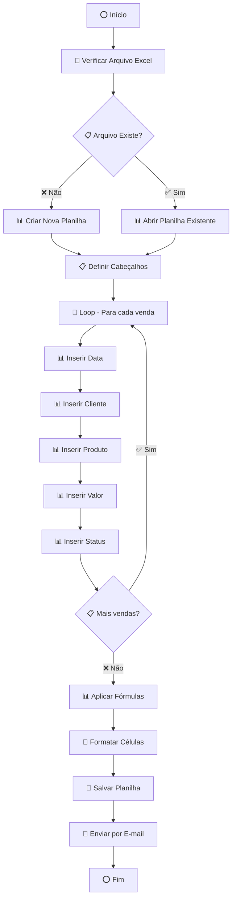

#### Configuração Completa:
```json
{
  "excel_automation": {
    "file_settings": {
      "template_path": "C:\\Templates\\vendas_template.xlsx",
      "output_path": "C:\\Reports\\vendas_${date}.xlsx",
      "backup_enabled": true
    },
    "data_mapping": {
      "headers": ["Data", "Cliente", "Produto", "Valor", "Status"],
      "data_source": "${sales_data}",
      "date_format": "dd/mm/yyyy",
      "currency_format": "R$ #,##0.00"
    },
    "automation_steps": [
      {
        "step": "check_file_exists",
        "action": "Check if File Exists",
        "parameters": {
          "file_path": "${template_path}",
          "on_not_found": "create_new"
        }
      },
      {
        "step": "open_excel",
        "action": "Open Excel File",
        "parameters": {
          "file_path": "${template_path}",
          "visible": true
        }
      },
      {
        "step": "setup_headers",
        "action": "Write Range",
        "parameters": {
          "range": "A1:E1",
          "values": "${headers}",
          "format": "bold|center|background:lightblue"
        }
      },
      {
        "step": "process_sales",
        "action": "Loop",
        "parameters": {
          "collection": "${sales_data}",
          "item_variable": "sale"
        },
        "sub_steps": [
          {
            "action": "Write Cell",
            "parameters": {
              "cell": "A${current_row}",
              "value": "${sale.date}"
            }
          },
          {
            "action": "Write Cell",
            "parameters": {
              "cell": "B${current_row}",
              "value": "${sale.customer}"
            }
          },
          {
            "action": "Write Cell",
            "parameters": {
              "cell": "C${current_row}",
              "value": "${sale.product}"
            }
          },
          {
            "action": "Write Cell",
            "parameters": {
              "cell": "D${current_row}",
              "value": "${sale.value}",
              "format": "currency"
            }
          },
          {
            "action": "Write Cell",
            "parameters": {
              "cell": "E${current_row}",
              "value": "${sale.status}"
            }
          }
        ]
      },
      {
        "step": "apply_formulas",
        "action": "Apply Formula",
        "parameters": {
          "cell": "D${last_row + 1}",
          "formula": "SUM(D2:D${last_row})",
          "format": "currency|bold"
        }
      },
      {
        "step": "save_file",
        "action": "Save Excel File",
        "parameters": {
          "file_path": "${output_path}",
          "create_backup": true
        }
      },
      {
        "step": "send_email",
        "action": "Send Mail",
        "parameters": {
          "to": "${report_recipients}",
          "subject": "Relatório de Vendas - ${date}",
          "body": "Relatório de vendas do dia ${date} em anexo.",
          "attachments": ["${output_path}"]
        }
      }
    ]
  }
}
```

### 🎯 Exemplo 2: Processamento de Notas Fiscais

#### Cenário:
Automatizar o processamento de notas fiscais recebidas por e-mail, extraindo dados e lançando no sistema.

#### Fluxo BPMN:
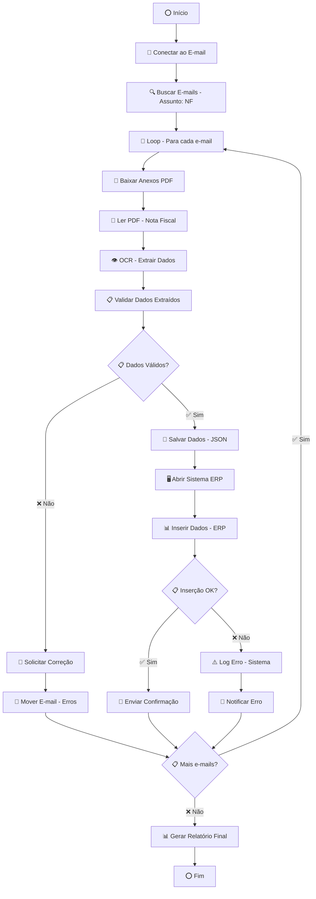

#### Configuração Completa:
```json
{
  "nf_processing": {
    "email_settings": {
      "server": "${imap_server}",
      "username": "${email_user}",
      "password": "${email_password}",
      "search_criteria": {
        "subject": "Nota Fiscal",
        "from": "${supplier_emails}",
        "has_attachments": true
      }
    },
    "pdf_processing": {
      "ocr_settings": {
        "language": "por",
        "confidence_threshold": 0.8,
        "preprocessing": ["deskew", "noise_reduction"]
      },
      "extraction_patterns": {
        "nf_number": "NF[\\s]*[Nn]úmero[\\s]*:?[\\s]*(\\d+)",
        "total_value": "Total[\\s]*:?[\\s]*R\\$[\\s]*(\\d+[.,]\\d+)",
        "issue_date": "Data[\\s]*[Ee]missão[\\s]*:?[\\s]*(\\d{2}/\\d{2}/\\d{4})",
        "supplier": "Fornecedor[\\s]*:?[\\s]*([A-Za-z\\s]+)",
        "cnpj": "CNPJ[\\s]*:?[\\s]*(\\d{2}\\.\\d{3}\\.\\d{3}/\\d{4}-\\d{2})"
      }
    },
    "validation_rules": {
      "required_fields": ["nf_number", "total_value", "issue_date", "supplier"],
      "format_validation": {
        "nf_number": "numeric|min:1",
        "total_value": "numeric|min:0",
        "issue_date": "date_format:dd/MM/yyyy",
        "cnpj": "cnpj_format"
      }
    },
    "erp_integration": {
      "system_url": "${erp_url}",
      "login_credentials": {
        "username": "${erp_user}",
        "password": "${erp_password}"
      },
      "data_mapping": {
        "nf_number": "campo_numero_nf",
        "total_value": "campo_valor_total",
        "issue_date": "campo_data_emissao",
        "supplier": "campo_fornecedor"
      }
    }
  }
}
```

### 🎯 Exemplo 3: Web Scraping com Validações

#### Cenário:
Automatizar a extração de dados de preços de produtos de um site de e-commerce e gerar relatório comparativo.

#### Fluxo BPMN:
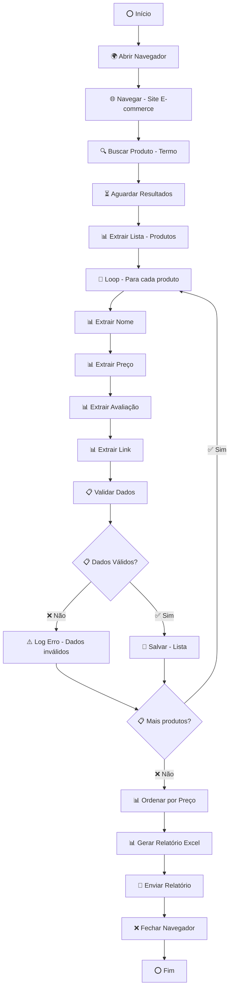

#### Configuração Completa:
```json
{
  "web_scraping": {
    "browser_settings": {
      "browser": "chrome",
      "headless": false,
      "window_size": "1920x1080",
      "user_agent": "Mozilla/5.0 (Windows NT 10.0; Win64; x64) AppleWebKit/537.36"
    },
    "target_website": {
      "base_url": "https://example-ecommerce.com",
      "search_url": "https://example-ecommerce.com/search?q=",
      "product_selector": "//div[@class='product-item']",
      "pagination_selector": "//a[@class='next-page']"
    },
    "data_extraction": {
      "product_name": {
        "selector": ".//h3[@class='product-name']",
        "attribute": "text",
        "required": true
      },
      "product_price": {
        "selector": ".//span[@class='price']",
        "attribute": "text",
        "required": true,
        "format": "currency"
      },
      "product_rating": {
        "selector": ".//div[@class='rating']/@data-rating",
        "attribute": "data-rating",
        "required": false,
        "format": "numeric"
      },
      "product_link": {
        "selector": ".//a[@class='product-link']",
        "attribute": "href",
        "required": true
      }
    },
    "validation_rules": {
      "product_name": "required|min_length:3|max_length:200",
      "product_price": "required|numeric|min:0",
      "product_rating": "numeric|min:0|max:5",
      "product_link": "required|url_format"
    },
    "report_generation": {
      "output_format": "excel",
      "file_path": "C:\\Reports\\price_comparison_${date}.xlsx",
      "columns": ["Nome", "Preço", "Avaliação", "Link", "Data_Coleta"],
      "sort_by": "price_asc",
      "include_charts": true
    }
  }
}
```

---

## Boas Práticas e Dicas

### 📝 Nomenclatura de Variáveis

#### Convenções Recomendadas:
```json
{
  "naming_conventions": {
    "variables": {
      "format": "snake_case",
      "prefixes": {
        "string": "str_",
        "number": "num_",
        "boolean": "bool_",
        "date": "dt_",
        "array": "arr_",
        "object": "obj_"
      },
      "examples": {
        "good": [
          "str_customer_name",
          "num_total_amount",
          "bool_is_valid",
          "dt_processing_date",
          "arr_product_list"
        ],
        "bad": [
          "var1",
          "temp",
          "data",
          "x",
          "result"
        ]
      }
    },
    "processes": {
      "format": "PascalCase",
      "examples": [
        "ProcessInvoiceData",
        "GenerateSalesReport",
        "ValidateCustomerInfo"
      ]
    },
    "files": {
      "format": "snake_case",
      "examples": [
        "invoice_processor.json",
        "sales_report_generator.json",
        "customer_validator.json"
      ]
    }
  }
}
```

### 🏗️ Estruturação de Fluxos

#### Organização Hierárquica:
```json
{
  "flow_structure": {
    "main_process": {
      "name": "MainProcess",
      "description": "Processo principal",
      "steps": [
        "initialization",
        "data_processing",
        "validation",
        "output_generation",
        "cleanup"
      ]
    },
    "sub_processes": {
      "initialization": {
        "steps": [
          "load_configuration",
          "initialize_variables",
          "connect_to_systems"
        ]
      },
      "data_processing": {
        "steps": [
          "read_input_data",
          "transform_data",
          "validate_data"
        ]
      },
      "validation": {
        "steps": [
          "business_rules_validation",
          "data_integrity_check",
          "error_handling"
        ]
      }
    }
  }
}
```

### ⚠️ Tratamento de Erros

#### Estratégia de Tratamento:
```json
{
  "error_handling_strategy": {
    "error_types": {
      "system_errors": {
        "handling": "log_and_retry",
        "max_retries": 3,
        "retry_interval": 5
      },
      "business_errors": {
        "handling": "log_and_continue",
        "notification": true
      },
      "data_errors": {
        "handling": "validate_and_correct",
        "fallback": "manual_review"
      }
    },
    "logging": {
      "level": "INFO",
      "format": "${timestamp} [${level}] ${process}: ${message}",
      "include_stack_trace": true,
      "log_to_file": true,
      "log_to_database": true
    },
    "notifications": {
      "email_alerts": true,
      "slack_notifications": true,
      "sms_alerts": false
    }
  }
}
```

### 🚀 Performance e Otimização

#### Técnicas de Otimização:
```json
{
  "performance_optimization": {
    "parallel_processing": {
      "enabled": true,
      "max_threads": 4,
      "batch_size": 100
    },
    "caching": {
      "enabled": true,
      "cache_duration": 3600,
      "cache_location": "memory"
    },
    "resource_management": {
      "memory_limit": "2GB",
      "cpu_limit": "80%",
      "disk_space_check": true
    },
    "network_optimization": {
      "connection_pooling": true,
      "timeout_settings": {
        "connection": 10,
        "read": 30,
        "total": 60
      }
    }
  }
}
```

### 📊 Logs e Monitoramento

#### Configuração de Monitoramento:
```json
{
  "monitoring_config": {
    "metrics": {
      "execution_time": true,
      "success_rate": true,
      "error_count": true,
      "resource_usage": true
    },
    "alerts": {
      "execution_time_threshold": 300,
      "error_rate_threshold": 5,
      "memory_usage_threshold": 80,
      "cpu_usage_threshold": 80
    },
    "dashboards": {
      "real_time_monitoring": true,
      "historical_analysis": true,
      "performance_trends": true
    }
  }
}
```

### 🔧 Manutenibilidade

#### Práticas de Manutenção:
```json
{
  "maintainability": {
    "documentation": {
      "process_documentation": true,
      "code_comments": true,
      "change_log": true
    },
    "version_control": {
      "git_integration": true,
      "branch_strategy": "feature_branches",
      "commit_messages": "conventional_commits"
    },
    "testing": {
      "unit_tests": true,
      "integration_tests": true,
      "regression_tests": true
    },
    "deployment": {
      "staging_environment": true,
      "production_deployment": "automated",
      "rollback_strategy": "automated"
    }
  }
}
```

---

## Troubleshooting Comum

### 🔍 Problemas com XPath

#### Problemas Frequentes:
```json
{
  "xpath_troubleshooting": {
    "common_issues": {
      "element_not_found": {
        "causes": [
          "XPath incorreto",
          "Elemento não carregado",
          "Página dinâmica",
          "Iframe ou popup"
        ],
        "solutions": [
          "Verificar XPath no browser",
          "Adicionar wait para elemento",
          "Usar seletores alternativos",
          "Verificar contexto (iframe)"
        ]
      },
      "xpath_fragile": {
        "causes": [
          "Usar posição absoluta",
          "IDs dinâmicos",
          "Classes CSS alteradas"
        ],
        "solutions": [
          "Usar atributos estáveis",
          "Combinar múltiplos seletores",
          "Usar texto visível",
          "Implementar fallbacks"
        ]
      }
    },
    "best_practices": {
      "robust_xpaths": [
        "//button[@id='submit-btn']",
        "//input[contains(@class,'username')]",
        "//div[text()='Login']",
        "//a[@href='/dashboard']"
      ],
      "testing_xpaths": [
        "Usar browser dev tools",
        "Testar em diferentes browsers",
        "Validar com dados reais",
        "Implementar testes automatizados"
      ]
    }
  }
}
```

### 🖥️ Sessões RDP/RDS

#### Problemas e Soluções:
```json
{
  "rdp_rds_troubleshooting": {
    "common_issues": {
      "session_disconnect": {
        "symptoms": [
          "Bot para de funcionar",
          "Aplicações fecham",
          "Perda de contexto"
        ],
        "solutions": [
          "Configurar sessão persistente",
          "Usar RDS ao invés de RDP",
          "Implementar reconexão automática",
          "Executar como serviço Windows"
        ]
      },
      "performance_issues": {
        "symptoms": [
          "Execução lenta",
          "Alto uso de CPU",
          "Falta de memória"
        ],
        "solutions": [
          "Otimizar recursos do servidor",
          "Implementar pooling de sessões",
          "Usar headless browsers",
          "Monitorar recursos"
        ]
      }
    },
    "configuration": {
      "rdp_settings": {
        "KeepAliveEnable": 1,
        "KeepAliveInterval": 1,
        "KeepAliveTimeout": 1,
        "MaxDisconnectionTime": 0,
        "MaxIdleTime": 0
      },
      "rds_settings": {
        "session_timeout": 0,
        "idle_timeout": 0,
        "disconnect_timeout": 0,
        "max_sessions": 10
      }
    }
  }
}
```

### ⏱️ Timeouts

#### Configuração de Timeouts:
```json
{
  "timeout_troubleshooting": {
    "timeout_types": {
      "element_wait": {
        "default": 10,
        "recommended": 15,
        "maximum": 30
      },
      "page_load": {
        "default": 30,
        "recommended": 60,
        "maximum": 120
      },
      "network_request": {
        "default": 30,
        "recommended": 60,
        "maximum": 300
      },
      "database_query": {
        "default": 30,
        "recommended": 60,
        "maximum": 300
      }
    },
    "troubleshooting": {
      "timeout_too_short": {
        "symptoms": ["Falhas frequentes", "Elementos não encontrados"],
        "solution": "Aumentar timeout gradualmente"
      },
      "timeout_too_long": {
        "symptoms": ["Execução lenta", "Recursos bloqueados"],
        "solution": "Otimizar seletores e reduzir timeout"
      }
    }
  }
}
```

### 🔍 Elementos Não Encontrados

#### Diagnóstico e Solução:
```json
{
  "element_not_found_troubleshooting": {
    "diagnostic_steps": [
      "Verificar se elemento existe na página",
      "Confirmar se página carregou completamente",
      "Verificar se elemento está visível",
      "Testar XPath no browser dev tools"
    ],
    "common_causes": {
      "page_not_loaded": {
        "solution": "Adicionar wait para página carregar"
      },
      "element_in_iframe": {
        "solution": "Mudar contexto para iframe"
      },
      "element_dynamic": {
        "solution": "Usar wait para elemento aparecer"
      },
      "xpath_incorrect": {
        "solution": "Corrigir XPath ou usar seletores alternativos"
      }
    },
    "prevention": {
      "robust_selectors": true,
      "multiple_fallbacks": true,
      "comprehensive_testing": true,
      "regular_maintenance": true
    }
  }
}
```

### 🐌 Performance Lenta

#### Otimização de Performance:
```json
{
  "performance_troubleshooting": {
    "common_bottlenecks": {
      "network_operations": {
        "impact": "high",
        "solutions": [
          "Implementar connection pooling",
          "Usar cache quando possível",
          "Otimizar tamanho de requests",
          "Usar CDN quando aplicável"
        ]
      },
      "database_operations": {
        "impact": "high",
        "solutions": [
          "Otimizar queries",
          "Usar índices apropriados",
          "Implementar paginação",
          "Usar connection pooling"
        ]
      },
      "file_operations": {
        "impact": "medium",
        "solutions": [
          "Processar em lotes",
          "Usar streams para arquivos grandes",
          "Implementar compressão",
          "Otimizar I/O assíncrono"
        ]
      },
      "ui_operations": {
        "impact": "medium",
        "solutions": [
          "Usar headless browsers",
          "Otimizar seletores",
          "Reduzir screenshots",
          "Implementar waits inteligentes"
        ]
      }
    },
    "monitoring": {
      "metrics": [
        "execution_time",
        "memory_usage",
        "cpu_usage",
        "network_latency",
        "error_rate"
      ],
      "alerts": {
        "performance_degradation": true,
        "resource_exhaustion": true,
        "error_spike": true
      }
    }
  }
}
```

---

## Conclusão

Este guia completo do **MuleSoft RPA Builder** fornece uma visão abrangente de todas as funcionalidades, categorias do Toolbox, conceitos fundamentais de RPA e boas práticas para desenvolvimento de automações robustas e eficientes.

### 🎯 Principais Takeaways:

1. **📚 Conhecimento Fundamental**: Entenda RDS, RDP, RDT e BPMN antes de começar
2. **🧰 Toolbox Completa**: 15 categorias de ações para todas as necessidades
3. **🏗️ Estruturação**: Organize fluxos de forma hierárquica e modular
4. **⚠️ Tratamento de Erros**: Implemente estratégias robustas de error handling
5. **🚀 Performance**: Otimize para máxima eficiência
6. **📊 Monitoramento**: Mantenha visibilidade completa dos processos
7. **🔧 Manutenibilidade**: Documente e teste adequadamente

### 📖 Recursos Adicionais:

- **Documentação Oficial**: [MuleSoft RPA Builder Docs](https://docs.mulesoft.com/rpa-builder/latest/toolbox)
- **Comunidade**: Fóruns e grupos de usuários
- **Treinamentos**: Cursos e certificações oficiais
- **Suporte**: Portal de suporte técnico

### 🚀 Próximos Passos:

1. **Pratique** com os exemplos fornecidos
2. **Experimente** diferentes categorias do Toolbox
3. **Implemente** as boas práticas sugeridas
4. **Monitore** e otimize seus processos
5. **Compartilhe** conhecimento com a comunidade

**Lembre-se**: O RPA é uma jornada de melhoria contínua. Comece simples, evolua gradualmente e sempre mantenha o foco na entrega de valor para o negócio! 🎯